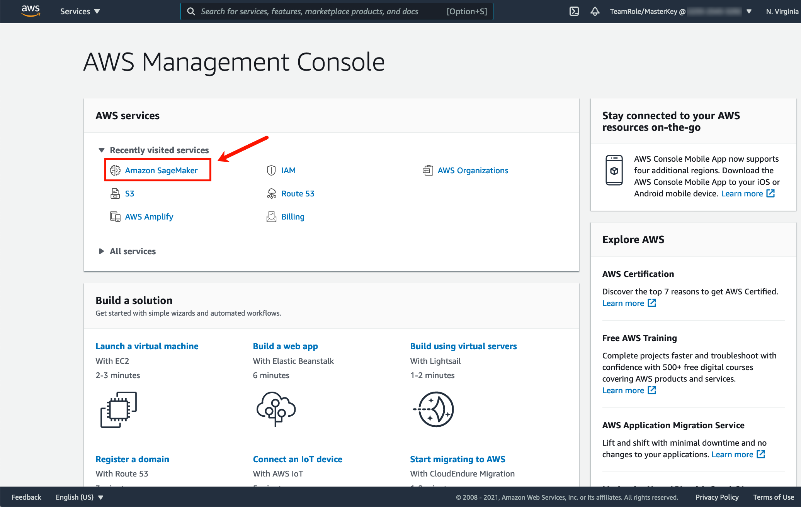

# Hugging Face on Amazon SageMaker Workshop

Earlier this year we announced a strategic collaboration with Amazon to make it easier for companies to use Hugging Face in SageMaker, and ship cutting-edge Machine Learning features faster. We introduced new Hugging Face Deep Learning Containers (DLCs) to train Hugging Face Transformer models in Amazon SageMaker.

In addition to the Hugging Face Inference Deep Learning Containers, we created a new Inference Toolkit for SageMaker. This new Inference Toolkit leverages the pipelines from the transformers library to allow zero-code deployments of models, without requiring any code for pre- or post-processing. In the "Getting Started" section below, you will find two examples of how to deploy your models to Amazon SageMaker.

The Inference Toolkit also supports "bring your own code" methods, where you can override the default methods. You can learn more about "bring your own code" in the documentation here, or you can check out the sample notebook "deploy custom inference code to Amazon SageMaker".

In this workshop we are going to cover: 

* Deploy a trained model on Amazon SageMaker
    * Load a pre-trained model from S3 and deploy on Amazon SageMaker endpoint for real-time inference 
    * Deploy a pre-trained model from S3 and deploy on Amazon SageMaker endpoint for batch inference
* Train on Amazon SageMaker
    * Prepare and upload a test dataset to S3
    * Prepare a fine-tuning script to be used with Amazon SageMaker Training jobs
    * Launch a training job and store the trained model into S3

# Getting Started

For this workshop you’ll get access to a temporary AWS Account already pre-configured with Amazon SageMaker Studio. Follow the steps in this section to login to your AWS Account and download the workshop material.

### 1. Navigate to Amazon SageMaker in the Management Console

### 2. Click on Notebook and then on Notebook instances 

### 3. Create a new Notebook instance

### 4. Configure Notebook instances

* Make sure to increase the Volume Size of the Notebook if you want to work with big models and datasets
* Add your IAM_Role with permissions to run your SageMaker Training And Inference Jobs
* Add the Workshop Github Repository to the Notebook to preload the notebooks: `https://github.com/philschmid/prosus-sagemaker-huggingface-workshop.git`

### 5. Open the Lab and select the right kernel you want to do and have fun!  

Open the lab you want to do (`training/` or `inference/`) and select the pytorch kernel

#### Sources:

* https://huggingface.co/docs/sagemaker/main
* https://github.com/huggingface/notebooks/tree/master/sagemaker
* Links to datasets – these are sampled from PolEval 2019:
    * Train split: https://pai-marketplace21-tutorials.s3.amazonaws.com/practical-nlp/data/train.csv
    * Test split: https://pai-marketplace21-tutorials.s3.amazonaws.com/practical-nlp/data/test.csv
* Fine-tuned model: https://pai-marketplace21-tutorials.s3.amazonaws.com/practical-nlp/models/polish_cyberbullying_bert_base.tgz

